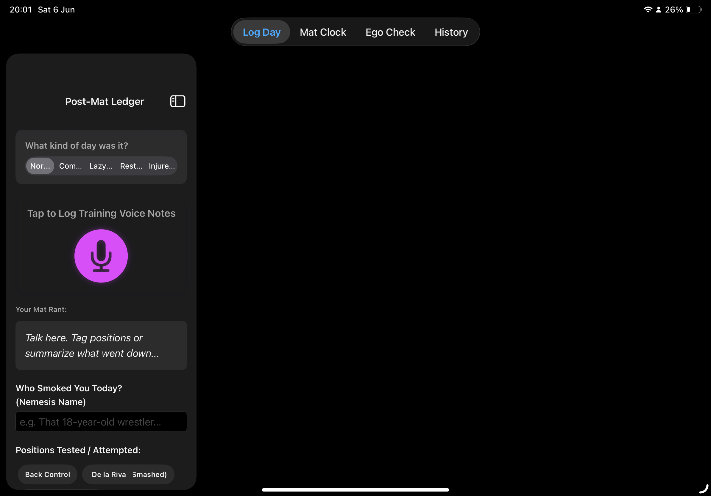
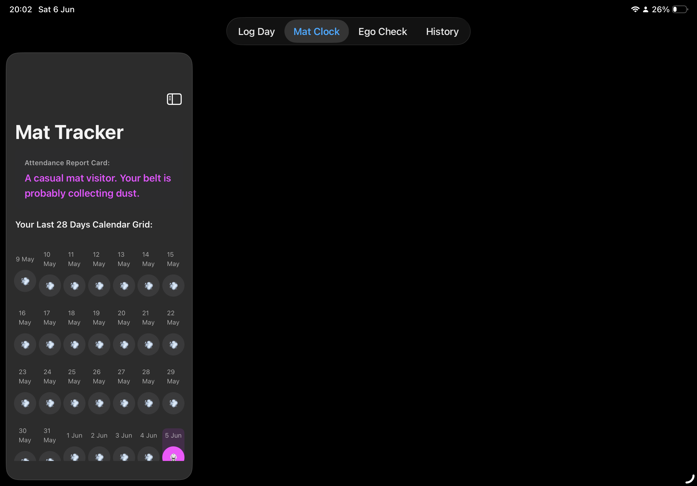
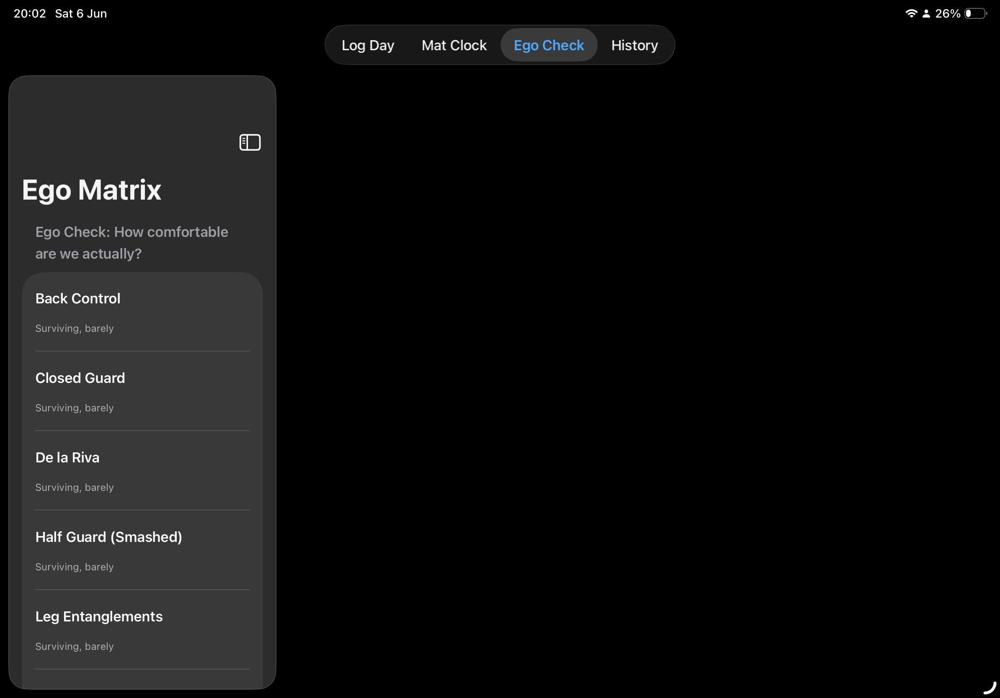
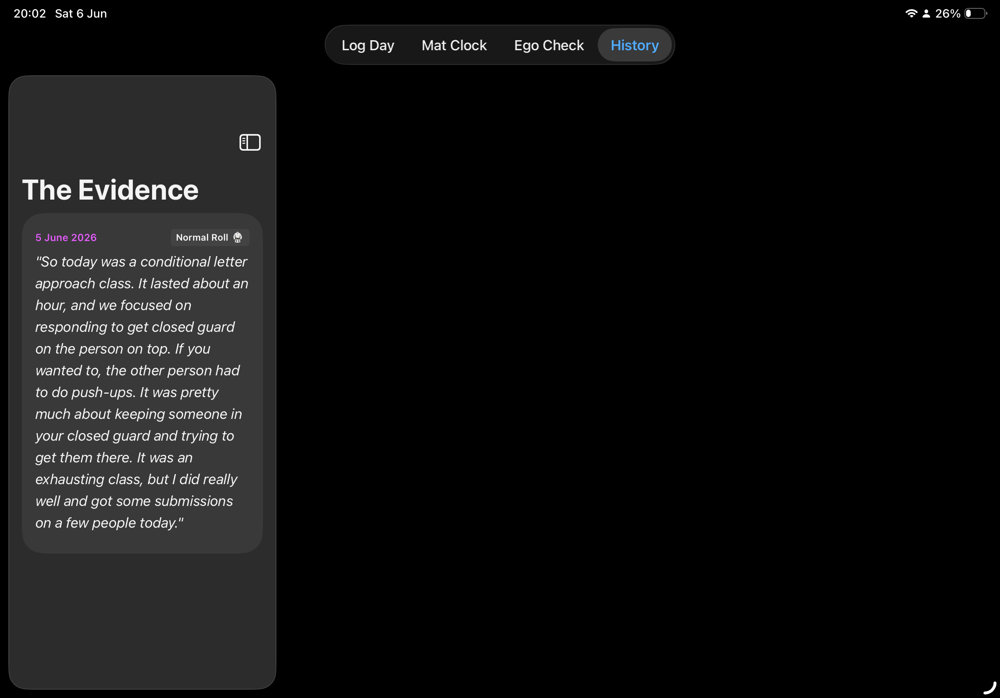

# BJJ Training Journal

A SwiftUI iOS application designed for Brazilian Jiu-Jitsu practitioners to track training sessions, attendance, position confidence, and personal progress over time.

## Project Background

This project began as a personal side project and birthday gift idea for a Brazilian Jiu-Jitsu enthusiast. The goal was to create a training companion that combines journaling, attendance tracking, performance reflection, and lighthearted analytics into a single mobile application.

While originally built for fun, the project provided valuable hands-on experience with SwiftUI development, speech-to-text integration, state management, user interface design, and mobile application architecture.

## Features

* Voice-based training journal
* Speech-to-text training notes
* Mat attendance tracking
* Position confidence tracking
* Training history review
* Performance reflection tools
* Humorous "Ego Check" analysis
* Dark mode user interface

## Screenshots

### Main Training Log

Record training sessions, voice notes, positions practiced, and post-training reflections.

### Mat Tracker

Track attendance patterns and monitor training consistency over time.

### Ego Matrix

Evaluate confidence levels across different Brazilian Jiu-Jitsu positions using a lighthearted scoring system.

### Training History

Review previous entries, training notes, and long-term progress.

## Technologies Used

* Swift
* SwiftUI
* Speech Recognition Framework
* OpenAI API
* Xcode

## Skills Demonstrated

* iOS Application Development
* SwiftUI Interface Design
* State Management
* API Integration
* Speech-to-Text Processing
* User Experience (UX) Design
* Mobile App Architecture
* Data Tracking and Visualization

## Future Improvements

* Apple Watch integration
* Cloud synchronization
* Belt progression tracking
* Advanced analytics dashboard
* Exportable training reports
* Multi-device support

## Author

**Nanalise Howe**

Mathematics (Data Science) Student
Austin Peay State University

* Current GPA: 3.9
* Expected Graduation: Fall 2026

Interested in Data Science, Machine Learning, Mobile Application Development, and AI-powered applications.
